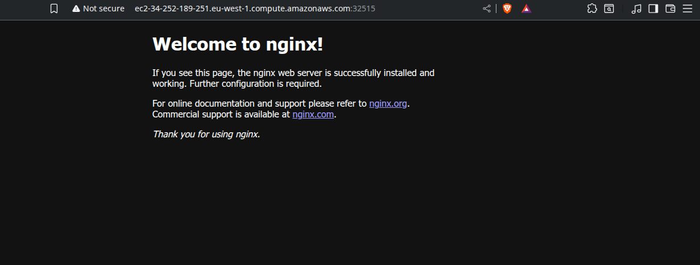
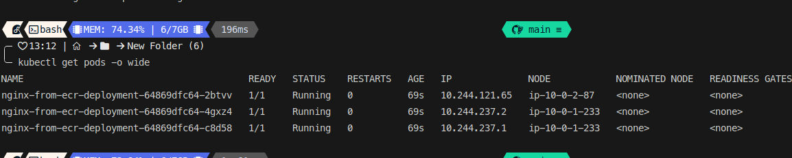

# Deploying a Kubernetes Cluster on AWS with Terraform and Cloud-init

## Overview

This project provides a comprehensive and automated solution for deploying a Kubernetes cluster on AWS using `kubeadm`. It leverages Terraform for infrastructure provisioning and Cloud-init for bootstrapping and configuring the nodes.

This project was developed as a conversion from an initial Ansible-based playbook, evolving into a robust Infrastructure as Code (IaC) solution. It incorporates several fixes and improvements identified during a collaborative development process, addressing common pitfalls in `kubeadm` deployments such as CNI plugin initialization, `PriorityClass` issues, and user permissions for `kubectl`.

The final architecture is fully automated, from creating the network infrastructure and EC2 instances to initializing the master node, installing the CNI, and joining worker nodes to the cluster.

## Architecture

The project is structured using Terraform modules to ensure separation of concerns and reusability.

*   **VPC Module (`modules/vpc`):** Manages all networking components, including the VPC, public subnets, Internet Gateway, route tables, and security groups for the master and worker nodes.
*   **Master Node Module (`modules/master-node`):** Provisions the control plane EC2 instance. It uses a `cloud-init` script to handle all setup tasks, including installing prerequisites, running `kubeadm init`, applying the Calico CNI, and configuring `kubectl` for the user. It also fetches the `kubeadm` join command for the worker nodes.
*   **Worker Node Module (`modules/worker-node`):** Provisions the worker EC2 instances. It uses a `cloud-init` script to install prerequisites and execute the `kubeadm join` command provided by the master. It also handles the labeling of worker nodes after they successfully join the cluster.
*   **Root Module (`main.tf`):** Orchestrates the deployment by calling the other modules, generating the necessary SSH keys, and passing data (like the join command) between the master and worker modules.

## Prerequisites

Before you begin, ensure you have the following installed and configured:
1.  **Terraform:** [Install Terraform](https://learn.hashicorp.com/tutorials/terraform/install-cli)
2.  **AWS CLI:** [Install and Configure AWS CLI](https://docs.aws.amazon.com/cli/latest/userguide/cli-chap-configure.html) (with credentials configured).

## Project Structure

```
.
├── main.tf
├── variables.tf
├── outputs.tf
├── README.md
├── modules/
│   ├── vpc/
│   │   ├── main.tf
│   │   ├── variables.tf
│   │   └── outputs.tf
│   ├── master-node/
│   │   ├── main.tf
│   │   ├── variables.tf
│   │   ├── outputs.tf
│   │   └── templates/
│   │       └── master-cloud-init.sh.tpl
│   └── worker-node/
│       ├── main.tf
│       ├── variables.tf
│       ├── outputs.tf
│       └── templates/
│           └── worker-cloud-init.sh.tpl
└── scripts/
    └── common-k8s-prereqs.sh.tpl
```

## How to Use

1.  **Clone the Repository:**
    ```bash
    git clone <your-repo-url>
    cd <your-repo-name>
    ```

2.  **Initialize Terraform:**
    This will download the necessary providers (AWS, TLS, Local).
    ```bash
    terraform init
    ```

3.  **Apply the Configuration:**
    This command will create all the AWS resources and provision the Kubernetes cluster. The process will take several minutes.
    ```bash
    terraform apply --auto-approve
    ```

4.  **Connect to Your Cluster:**
    Once the `apply` command is complete, it will generate a private key file (e.g., `my-k8s-cluster-ssh-key.pem`) and a `kubeconfig` file (`kubeconfig-master.conf`) in the root directory of the project.

    *   **Set up your local `kubectl`:**
        ```bash
        export KUBECONFIG=./kubeconfig-master.conf
        ```
    *   **Verify the cluster status:**
        ```bash
        kubectl get nodes
        ```
    #   ** for pull image from ECR:**
        ```
        kubectl apply -f deployment/nginx-ecr-deployment.yaml
        ```

        You should see your `controlplane` and `worker` nodes, all with a `Ready` status. It might take a few moments for all nodes to become ready.
    *   **you will find private authentication key :**
        `my-k8s-cluster-ssh-key.pem` in working directory
    

        

        
